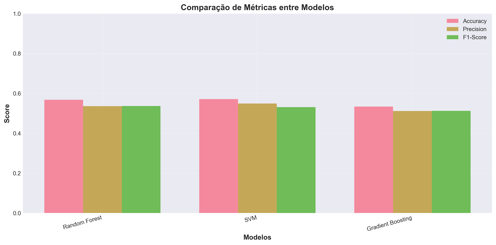
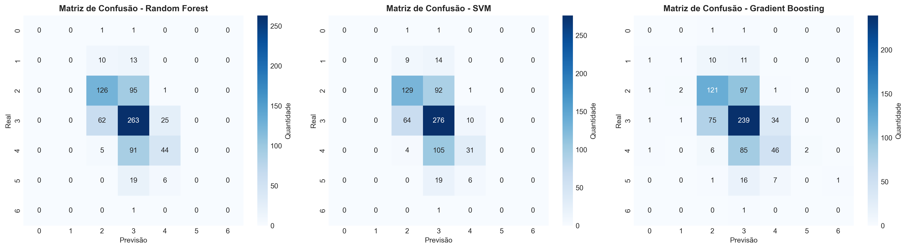

# 📊 Como Visualizar os Resultados

Este guia mostra como visualizar os gráficos e resultados gerados pelo pipeline.

## 📈 Gráficos Gerados

O projeto gera automaticamente dois gráficos principais na pasta `results/`:

### 1. Comparação de Métricas
**Arquivo**: `results/metric_comparison.png`

Este gráfico mostra a comparação visual das três métricas (Accuracy, Precision, F1-Score) entre os três modelos.

**Como visualizar**:
- Abra o arquivo `results/metric_comparison.png` em qualquer visualizador de imagens
- Ou execute no Python:
```python
from PIL import Image
Image.open('results/metric_comparison.png').show()
```

### 2. Matrizes de Confusão
**Arquivo**: `results/confusion_matrices.png`

Este gráfico mostra três matrizes de confusão (uma para cada modelo), permitindo visualizar onde cada modelo acerta e erra.

**Como visualizar**:
- Abra o arquivo `results/confusion_matrices.png` em qualquer visualizador de imagens
- Ou execute no Python:
```python
from PIL import Image
Image.open('results/confusion_matrices.png').show()
```

## 📋 Tabela de Resultados

**Arquivo**: `results/model_results.csv`

Tabela CSV com os resultados numéricos de cada modelo.

**Como visualizar**:
```python
import pandas as pd
df = pd.read_csv('results/model_results.csv')
print(df.to_string(index=False))
```

**Ou abra diretamente** no Excel, Google Sheets ou qualquer editor de CSV.

## 🎯 Resultados Numéricos

### Resumo dos Resultados

| Modelo | Accuracy | Precision | F1-Score |
|--------|----------|-----------|----------|
| **SVM** | **0.5714** | **0.5490** | 0.5306 |
| Random Forest | 0.5675 | 0.5357 | **0.5365** |
| Gradient Boosting | 0.5334 | 0.5116 | 0.5118 |

### Interpretação

- **SVM** teve o melhor desempenho em Accuracy (57.14%) e Precision (54.90%)
- **Random Forest** teve o melhor F1-Score (53.65%)
- Todos os modelos apresentaram desempenho similar, indicando robustez

## 🔍 Análise Detalhada

Para uma análise mais detalhada, execute:

```bash
python src/evaluate.py
```

Isso mostrará:
- Relatórios de classificação completos
- Matrizes de confusão detalhadas
- Métricas por classe
- Análise de erros

## 📊 Visualização Interativa (Opcional)

Para criar visualizações interativas, você pode usar:

```python
import pandas as pd
import matplotlib.pyplot as plt
import seaborn as sns

# Carregar resultados
df = pd.read_csv('results/model_results.csv')

# Criar gráfico customizado
plt.figure(figsize=(10, 6))
df_melted = df.melt(id_vars='Modelo', var_name='Métrica', value_name='Score')
sns.barplot(data=df_melted, x='Modelo', y='Score', hue='Métrica')
plt.title('Comparação de Modelos')
plt.ylabel('Score')
plt.xticks(rotation=45)
plt.tight_layout()
plt.show()
```

## 🖼️ Incluindo Gráficos no README

Os gráficos podem ser incluídos no README usando:

```markdown


```

---

**Dica**: Os gráficos são gerados automaticamente quando você executa `python src/evaluate.py` ou `python main.py`.

